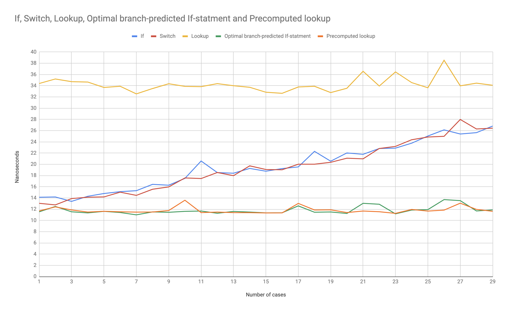

# Javascript if vs switch vs lookup performance

Run `node index.js` to compare the performance of different control structures.

See [cases.js](cases.js) for examples of the different test cases.

# Results

